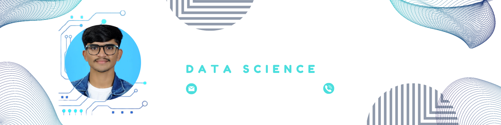

<h1 align="center">Hi 👋, I'm Mahesh Chavan</h1>
<h3 align="center">A passionate Data science engineering student</h3>

  

  

  

- 🔭 I’m currently studying Computer science (Data science)) **machine learning,data wranglig etc**

- 🌱 I’m currently learning **machine learning,data wrangling**

- 👨‍💻 My portfolio is available at [https://maheshchavancseds.wixsite.com/maheshbloggs-1](https://maheshchavancseds.wixsite.com/maheshbloggs-1)

- 💬 Ask me about **python automation libraries**

- 📫 How to reach me **maheshchavan.dse@gmail.com**

- ⚡ Fun fact **i am funny lets laugh together**

<h3 align="left">Connect with me:</h3>

<h3 align="left">Languages and Tools:</h3>

                

&nbsp;

